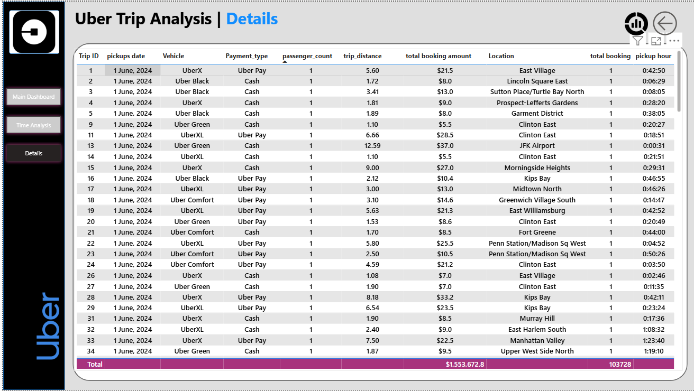

# 🚖 Uber Trip Analysis Dashboard  

This project is a **Power BI Dashboard** built to analyze Uber trips data.  
It provides actionable insights into booking patterns, trip distances, payment methods, and vehicle type performance.  

---

## 📊 Key Features
- **Overview Dashboard** → Total bookings, revenue, avg trip time & distance.  
- **Time Analysis Dashboard** → Bookings by hour, day, and weekday trends.  
- **Details Dashboard** → Trip-level details including distance, fare, and payment type.  

---

## 📷 Dashboard Previews  

### 🏠 Main Dashboard  


### ⏰ Time Analysis Dashboard  


### 📑 Details Dashboard  


---

## 🛠️ Tools & Technologies
- **Power BI** – For dashboard development  
- **Data Cleaning** – Power Query  
- **Data Modeling** – Relationships & DAX measures  

---

## 📈 Insights
- Peak booking hours are between **2 PM – 6 PM**.  
- **UberX** contributes the highest share of bookings & revenue.  
- Majority of trips are **short distance (avg 3 km, 16 mins)**.  
- **Cash & Uber Pay** dominate the payment methods.  

---

## 🚀 How to Use
1. Clone this repository:  
   ```bash
   git clone https://github.com/your-username/uber-trip-analysis.git
# uber-project-
